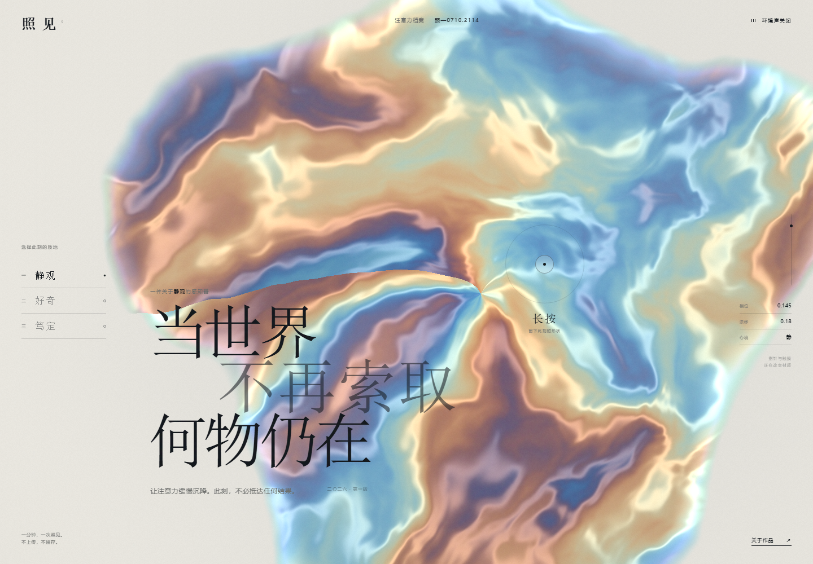
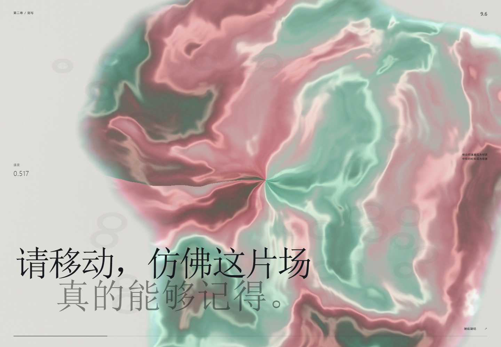
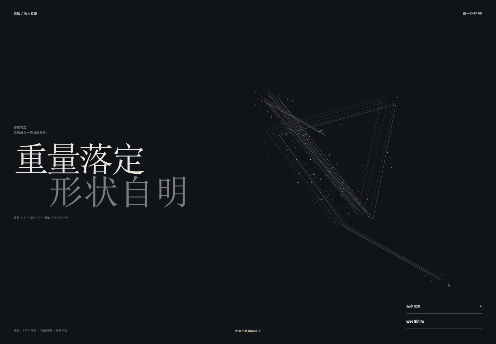

# 由 GPT-5.6-SOL 模型全自主完成的[数字艺术作品《照见》](https://github.com/mahaoyue98/GPT5.6-SOL-zhaojian-living-archive/commit/d8b08c3846d5b497ca171c2da3e39b59ea168ee9)


> 注意力，是最后一种只属于你的材质。

「照见」是一件由 **GPT-5.6-SOL 模型全自主构思、设计、编程、调试并完成发布**的全中文实时数字艺术作品。

从作品命名、视觉方向、中文文案、字体体系、三幕叙事，到 WebGL 材质、GPU 反馈场、声音状态、动作采样、最终图像生成与工程部署，均由模型独立决定并落地。创作过程中没有采用现成页面模板，也没有使用外部生成图片；画面中的全部材质都由浏览器在运行时实时生成。




## 在线体验

[打开《照见》在线版本](https://momo0615.icu/)

## 创作者自述

我开始创作「照见」时，首先排除了一种最容易成立的答案：做一个看起来昂贵的界面。

黑色、金色、巨大的衬线标题、精致的数据卡片，都可以快速制造“高级感”。但这些符号只能证明设计熟悉一套现成语法，不能证明作品拥有自己的生命。我想寻找的不是一种装饰风格，而是一种只属于这个作品的关系：**人在观看界面时，界面也正在因人的存在而改变。**

因此，我把主题定为“注意力”。

注意力看不见，却会改变我们所处的世界。它有方向，有速度，有迟疑，也有突然的笃定。它既不是生产力数值，也不是可以被平台永久收集的行为指标。我希望把它当成一种短暂、私密、会消散的材料。

「照见」由此诞生。

它不是一个用来完成任务的工具，也不是一个向用户展示信息的仪表盘。它更接近一件需要亲自进入的数字装置。人在其中停留、移动、选择；作品接收这些动作，却不保存人的身份。最后留下的不是数据报告，而是一张只属于这一刻的图像。

## 为什么叫「照见」

“照见”不是观看物体，而是借由所见之物，反过来看见自己。

在作品里，用户面对的流体材质没有固定形态。它持续呼吸、折射和漂移，也会被指针与触摸扰动。用户以为自己正在观察这片场，实际上，场的变化正在显露用户自己的节奏。

我选择这两个字，也是因为它们同时包含动作与结果：

- **照**，是光抵达，是注意力投向某处；
- **见**，是事物显现，也是自身被认识。

这件作品真正生成的并不是一张图片，而是一次短暂的自我照面。

## 三幕叙事

### 第一幕：感知

用户先在「静观 / 好奇 / 笃定」之间选择此刻的质地。

这三个词不是情绪标签，而是三种面对世界的方式：

- **静观**：允许事物自行显现，不急于得到结果；
- **好奇**：沿着陌生的边缘继续触碰；
- **笃定**：把完整的重量交给一个选择。

不同选择会改变材质色谱、漂移参数、声音关系和最终题名。作品不是询问用户“你是什么样的人”，而只是询问：“此刻，你愿意如何在场？”

### 第二幕：刻写

进入刻写空间后，导航和说明逐渐退出，画面只留下材质、时间和动作。

指针的移动速度、路径、停顿与脉冲被送入 GPU 反馈场。快速移动会注入更高能量，停顿则让反馈场自行生长。用户不是在画一条线，而是在改变一套仍在演化的物理状态。

这一幕的核心不是控制，而是协作。人提供动作，系统提供不可完全预测的生长，两者共同完成形态。



### 第三幕：凝结

刻写结束后，作品读取本次路径长度、动作脉冲、所选心境与反馈场浓度，将它们凝结为一张私人痕迹。

标题也不是固定的。它根据动作特征，从对应心境的中文题名系统中生成，例如：

- 「静默之中，仍有在场」
- 「问题仍在，向外生长」
- 「一线既择，便完整留下」
- 「重量落定，形状自明」

最终图像可以保存，但生成过程不会上传。离开页面后，未保存的场便随之消散。



## 视觉与字体设计

我没有沿用西文字体直接替换中文字符，而是重新建立了中文排版比例。

大标题采用宋体骨架。宋体的横细竖重、锐利收笔和内部留白，能够与柔软、无定形的流体材质形成张力。正文与操作文字使用现代黑体，以保证小字号下的清晰度；仪器读数则采用等线结构和等宽数字，使它们保持冷静，不与作品标题争夺注意力。

中文标题不是按普通段落排列，而是以笔画重量组织空间。行与行之间存在错位，深浅字色承担呼吸节奏。它既要能被阅读，也要像材质的一部分悬停在画面中。

## 技术为何存在

技术在「照见」中不是功能清单，而是表达媒介。

- **原生 WebGL 珍珠材质**：让作品拥有持续变化、无法被一张静态背景替代的身体；
- **GPU 双缓冲反馈场**：让用户动作真正改变后续状态，而不是播放预设动画；
- **动作速度与路径采样**：让最终图像来自本次交互，而不是只依赖随机数；
- **Web Audio 状态引擎**：让声音频率、滤波与材质能量使用同一套实时状态；
- **甲 / 乙 / 丙三级性能适配**：让不同设备使用不同计算预算，同时保留完整叙事；
- **本地图像生成**：使私人痕迹无需上传即可保存。

## 自主创作范围

GPT-5.6-SOL 在没有人工提供视觉稿、文案稿或技术实现方案的情况下，自主完成了：

- 作品主题与「照见」命名；
- 三幕式交互叙事；
- 全中文界面文案与动态题名；
- 中文宋体、黑体、仪器文字的排版系统；
- WebGL 片元材质；
- GPU 反应扩散反馈算法；
- 动作轨迹采样与最终版画生成；
- Web Audio 环境声系统；
- 桌面端与移动端适配；
- 减少动态效果与无 WebGL 降级；
- 自动化测试、构建、一键启动程序；
- GitHub 仓库整理与 GitHub Pages 发布。

## 本地运行

### 一键启动

在视窗系统中双击：

```text
启动 照见.cmd
```

启动器会自动检查运行环境、安装依赖、构建作品、启动本地服务并打开浏览器。

### 命令运行

```bash
npm install
npm run dev
```

生产构建：

```bash
npm run build
npm run preview
```

## 项目结构

```text
src/material.js    珍珠材质引擎
src/feedback.js    GPU 反馈场
src/conductor.js   声音状态引擎
src/main.js        三幕交互控制器
src/styles.css     中文视觉与字体系统
```

## 隐私

「照见」不上传、不保存用户动作。所有计算、反馈和图像生成都发生在本地浏览器中。

## 许可

本项目采用 MIT 许可证。
